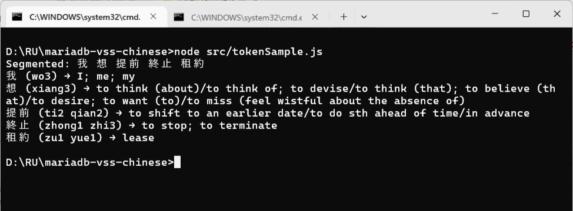
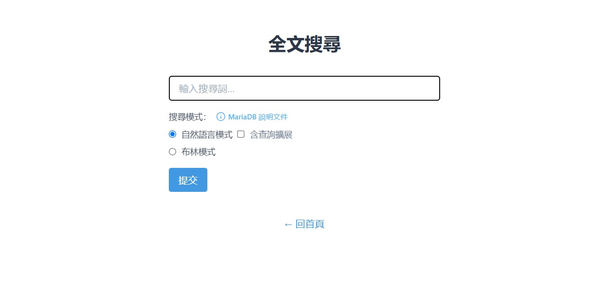

### Fulltext Search in Chinese using MariaDB
> While vectorization is about model; tokenization is about dictionary. 

**DISCLAIMER: Over 95% of this article is written by HIM, i mean the AI**


#### Prologue 
Computer was not invented by Chinese people and many crucial software neither. Working with chinese data in real life poses issues of this and that. Some of them pertaining to input and display; others related to data retrieval. In RDBMS, the search of Chinese data heavily depends on pattern matching technique with `LIKE` and `%`. [Full-text search](https://en.wikipedia.org/wiki/Full-text_search) empowers developers with more advanced search capability but lacks support for chinese languages. 

Chinese text presents a unique challenge for fulltext search: no spaces, dense meaning, and complex character structure. But with proper preprocessing—segmentation, tuning token length, and a few MariaDB tricks—you can enable fast, meaningful search even in Traditional Chinese. This guide walks you through how to make it work, from setup to query.


#### I. Fulltext search issue 
MariaDB’s built-in **FULLTEXT search** (like MySQL’s) relies on **word tokenization**—but Chinese doesn’t use spaces between words. So the engine can’t tell where one word ends and another begins.

As a result:
- It may treat the entire sentence as one “word”
- Searches for short terms (like 1–2 characters) often fail
- Relevance scoring becomes meaningless

**Workarounds & Solutions**
1. **Use Mroonga plugin**
- Mroonga is a full-text search engine for MySQL/MariaDB that supports **morphological analysis** for Chinese and Japanese.
- It uses [Groonga](https://groonga.org/) under the hood and handles CJK tokenization properly.
- You can install it and switch your table’s storage engine to `Mroonga`. [More on Mroonga setup](https://www.cnblogs.com/kjcy8/articles/16643748.html)

2. **Preprocess text into searchable tokens**
- Use a Chinese tokenizer (like [jieba](https://github.com/fxsjy/jieba) in Python) to segment your text into words.
- Store the segmented version in a separate column.
- Create a FULLTEXT index on that column.

Example:
```text
原文: 我想提前終止租約
分詞: 我 想 提前 終止 租約
```

3. **Use semantic search instead**
If you’re already exploring vector search (like with MariaDB VSS), you can skip tokenization entirely and use **embedding-based search**. This works beautifully for Chinese—including Traditional Chinese—and gives better relevance for meaning, not just keywords.


#### II. Fulltext search issue (cont.)
For **Traditional Chinese word segmentation** in Node.js, the best tool depends on your priorities—accuracy, speed, or ease of setup. Here's a quick rundown of the top contenders:

1. **Best Overall for Traditional Chinese: [`chinese-tokenizer`](https://github.com/yishn/chinese-tokenizer)**
- **Strengths**: Uses the [CC-CEDICT](https://www.mdbg.net/chinese/dictionary?page=cc-cedict) dictionary, which includes both Simplified and Traditional Chinese.
- **Pros**:
  - Accurate segmentation for Traditional Chinese
  - Returns rich metadata (pinyin, English meaning, etc.)
- **Cons**: Requires downloading and loading the dictionary file manually
- **Ideal for**: Projects that need precise segmentation and Traditional Chinese support

2. **Fastest & Most Popular: [`nodejieba`](https://www.npmjs.com/package/nodejieba)**
- **Strengths**: Native bindings to the powerful jieba tokenizer
- **Pros**:
  - Very fast
  - Easy to use
  - Good accuracy for both Simplified and Traditional Chinese
- **Cons**: Slightly biased toward Simplified Chinese unless you customize the dictionary
- **Ideal for**: Real-time applications or general-purpose tokenization

3. **Cross-platform & No Native Build: [`jieba-wasm`](https://www.npmjs.com/package/jieba-wasm)**
- **Strengths**: WebAssembly version of jieba
- **Pros**:
  - No native compilation needed
  - Works in browser and Node.js
- **Cons**: Slower than `nodejieba`
- **Ideal for**: Environments where native modules are hard to install (e.g., serverless)

4. Recommendation for Traditional Chinese:
If you're focused on **Traditional Chinese accuracy**, go with **`chinese-tokenizer`** and load the CC-CEDICT dictionary. If you want speed and simplicity, **`nodejieba`** is a great fallback—just be aware it leans Simplified unless you tweak it.


#### III. Tokenizer
Following the recommendation of AI, go ahead to download the dictionary file `cedict_ts.u8` from [CC-CEDICT](https://www.mdbg.net/chinese/dictionary?page=cc-cedict), and install the tokenizer with: 
```
npm install chinese-tokenizer
```

load and run our sample tokenizer. 
```
import tokenizer from 'chinese-tokenizer';
import path from 'path';
import { fileURLToPath } from 'url';

// Resolve dictionary path
const __filename = fileURLToPath(import.meta.url);
const __dirname = path.dirname(__filename);
const dictPath = path.join(__dirname, '..', 'src', 'dictionary', 'cedict_ts.u8');

// Load the dictionary and get the tokenizer instance
const segment = tokenizer.loadFile(dictPath);

// Segment Traditional Chinese text
const text = '我想提前終止租約';
const tokens = segment(text);

// Print segmented result
console.log('Segmented:', tokens.map(t => t.text).join(' '));

// Optional: show pinyin and English
tokens.forEach(({ text, matches }) => {
    const match = matches?.[0];
    const pinyin = match?.pinyin ?? '—';
    const english = match?.english ?? '—';
    console.log(`${text} (${pinyin}) → ${english}`);
  });
```



Our last job is to write the tokenizied chinese data into database, build our fulltext index and querying the data. 


#### IV. Re-seeding
Let roll up our sleeves and modify the `documents` table. First, by adapting to `bge-m3-q4_k_m.gguf` model for vector embeddings, then add new field  `textChiSeg` for segmented chinese text. 

```
USE vss;

CREATE TABLE documents (
  id          INT AUTO_INCREMENT PRIMARY KEY,

  textChi     VARCHAR(512) NOT NULL, 
  textChiSeg  VARCHAR(512) NOT NULL,  
  visited     INT DEFAULT 0, 
  embedding   VECTOR(1024) NOT NULL,  
  
  createdAt   TIMESTAMP DEFAULT CURRENT_TIMESTAMP, 
  updatedAt   TIMESTAMP, 
  updateIdent INT DEFAULT 0, 
    
  CONSTRAINT unique_textChi UNIQUE (textChi),
  FULLTEXT INDEX ft_textChiSeg (textChiSeg), 
  VECTOR INDEX vss_textCh (embedding) M=16 DISTANCE=cosine
);
```

To augment `addDocument` function. 
```
export async function addDocument(document) {
    const { vector } = await context.getEmbeddingFor(removeWords(document));
    const tokens = segment(removeWords(document));
    // Add new document
    return await prisma.$executeRaw`
                    INSERT INTO documents (textChi, textChiSeg, embedding) 
                    VALUES( ${document}, ${tokens.map(t => t.text).join(' ')},
                    VEC_FromText(${JSON.stringify(vector)}) ) 
                    ON DUPLICATE KEY 
                    UPDATE updateIdent = updateIdent + 1;
              `;
}
```

And re-seed with `npx prisma db seed`. 


#### V. my.ini 
If FULLTEXT search still isn't working, here are the most common culprits to check:

1. **Storage Engine**
Make sure your table is using a FULLTEXT-compatible engine like **InnoDB** or **Mroonga**. Run:

```
SHOW TABLE STATUS LIKE 'documents';
```

Look at the `Engine` column. If it's not `InnoDB` or `Mroonga`, FULLTEXT won't work properly.

2. **Index Exists on the Right Column**
Double-check that the FULLTEXT index is actually on the `textChiSeg` column:

```
SHOW INDEX FROM documents WHERE Index_type = 'FULLTEXT';
```

You should see `textChiSeg` listed. If not, create it:

```
ALTER TABLE documents ADD FULLTEXT(textChiSeg);
```

3. **Minimum Word Length (`ft_min_word_len`)**
By default, MariaDB ignores words shorter than **4 characters**. That’s a problem for Chinese, where most words are 1–3 characters.

To fix this:
- Set `ft_min_word_len = 1` in your MariaDB config (`my.cnf`)
- Then **rebuild the FULLTEXT index**:
  ```
  DROP INDEX ft_textChiSeg ON documents;
  ALTER TABLE documents ADD FULLTEXT(textChiSeg);
  ```

> Note: Changing `ft_min_word_len` requires a MariaDB restart.

4. **Character Set**
Ensure your column uses `utf8mb4`, not `latin1`:

```
SHOW FULL COLUMNS FROM documents;
```

If needed:
```
ALTER TABLE documents MODIFY textChiSeg VARCHAR(512) CHARACTER SET utf8mb4;
```

5. **Query Syntax**
Use `MATCH ... AGAINST` with the right mode:

```
SELECT * FROM documents
WHERE MATCH(textChiSeg) AGAINST('著迷 夜空' IN NATURAL LANGUAGE MODE);
```

Or for stricter matching:
```
SELECT * FROM documents
WHERE MATCH(textChiSeg) AGAINST('+著迷 +夜空' IN BOOLEAN MODE);
```

In a word, inside the [mysqld] section, add or update the following:
```
[mysqld]
ft_min_word_len=1
```

If you're using InnoDB's FULLTEXT, you also need:
```
innodb_ft_min_token_size=1
```

Below is my complate `my.ini`:
```
[mysqld]
datadir=C:/Program Files/MariaDB 11.7/data
port=3306
innodb_buffer_pool_size=1535M
character-set-server=utf8mb4

event_scheduler=ON

ft_min_word_len=1
innodb_ft_min_token_size=1

[client]
port=3306
plugin-dir=C:\Program Files\MariaDB 11.7/lib/plugin
```


#### VI. Fulltext search examples 
> FULLTEXT indexes are supported on `CHAR`, `VARCHAR`, and `TEXT` columns in **InnoDB** and **MyISAM**.

> This works because you've already segmented the Chinese text into searchable tokens.

1. Basic Search with `MATCH ... AGAINST`
```
SELECT * FROM documents
WHERE MATCH(textChiSeg) AGAINST('太陽');
```

This performs a **natural language search**—MariaDB ranks results by relevance.

> IN NATURAL LANGUAGE MODE is the default type of full-text search, and the keywords can be omitted. There are no special operators, and searches consist of one or more comma-separated keywords.

2. Boolean Mode Search
Use Boolean operators for more control:
```
SELECT * FROM documents
WHERE MATCH(textChiSeg) AGAINST('+太陽 +東' IN BOOLEAN MODE);
```

> Boolean search permits the use of a number of special operators:
- `+` → must include
- `-` → must not include
- `*` → wildcard (prefix match)
- `"` → exact phrase

3. Query Expansion Mode
```
SELECT * FROM documents
WHERE MATCH(textChiSeg) AGAINST('+太陽 +東' WITH QUERY EXPANSION);
```
> A query expansion search is a modification of a natural language search. The search string is used to perform a regular natural language search. Then, words from the most relevant rows returned by the search are added to the search string and the search is done again. The query returns the rows from the second search. The IN NATURAL LANGUAGE MODE WITH QUERY EXPANSION or WITH QUERY EXPANSION modifier specifies a query expansion search. It can be useful when relying on implied knowledge within the data, for example that MariaDB is a database.

4. Relevance Scoring
```
SELECT id, textChi, MATCH(textChiSeg) AGAINST('太陽') AS score
FROM documents
ORDER BY score DESC;
```
> MariaDB calculates a relevance for each result, based on a number of factors, including the number of words in the index, the number of unique words in a row, the total number of words in both the index and the result, and the weight of the word. In English, 'cool' will be weighted less than 'dandy', at least at present! The relevance can be returned as part of a query simply by using the MATCH function in the field list.

This lets you rank results by how well they match the query.

5. Tips & Gotchas
- FULLTEXT search ignores words shorter than 4 characters by default (configurable via `ft_min_word_len`)
- Works best on large datasets
- Use `IN BOOLEAN MODE` for exact control
- Use `WITH QUERY EXPANSION` for exploratory search
- Combine with `LIKE` or `REGEXP` for hybrid strategies

6. Other issues in Chinese query

You can query with: 
```
SELECT * FROM documents
WHERE MATCH(textChiSeg) AGAINST('太陽');
```

But not: 
```
SELECT * FROM documents
WHERE MATCH(textChiSeg) AGAINST('太');

SELECT * FROM documents
WHERE MATCH(textChiSeg) AGAINST('陽');
```

You can query with: 
```
SELECT * FROM documents
WHERE MATCH(textChiSeg) AGAINST('太*'  IN BOOLEAN MODE);
```

But not: 
```
SELECT * FROM documents
WHERE MATCH(textChiSeg) AGAINST('*陽'  IN BOOLEAN MODE);
```
> The wildcard, indicating zero or more characters. It can only appear at the end of a word.

7. Want More?
You can explore deeper examples and explanations in these tutorials:
- [How to do full text search in MariaDB – DinoGeek](https://dinogeek.me/EN/MariaDB/How-to-do-full-text-search-in-MariaDB.html)
- [MariaDB Full Text Search Tutorial – StackBay](https://stackbay.org/modules/chapter/learn-mariadb/full-text-search)
- [Introduction to Full Text Search in MariaDB – Severalnines](https://severalnines.com/blog/introduction-full-text-search-mariadb/)

Start the server: 
```
npm run dev 
```

And navigate to [http://localhost:3000/ftsearch](http://localhost:3000/ftsearch): 



Enjoy! 


#### VII. Bibliography 
1. [chinese-tokenizer](https://www.npmjs.com/package/chinese-tokenizer)
2. [CC-CEDICT download](https://www.mdbg.net/chinese/dictionary?page=cc-cedict)
3. [Full-Text Index Overview](https://mariadb.com/docs/server/ha-and-performance/optimization-and-tuning/optimization-and-indexes/full-text-indexes/full-text-index-overview)
4. [Server System Variables](https://mariadb.com/docs/server/ha-and-performance/optimization-and-tuning/system-variables/server-system-variables#ft_min_word_len)
5. [Configuring MariaDB with Option Files](https://mariadb.com/docs/server/server-management/install-and-upgrade-mariadb/configuring-mariadb/configuring-mariadb-with-option-files)
6. [Full-text search](https://www.prisma.io/docs/orm/prisma-client/queries/full-text-search)
7. [Raw queries](https://www.prisma.io/docs/orm/prisma-client/using-raw-sql/raw-queries)
8. [The Castle by Franz Kafka](https://files.libcom.org/files/Franz%20Kafka-The%20Castle%20(Oxford%20World's%20Classics)%20(2009).pdf)


#### Epilogue
With segmentation in place and indexes finely tuned, your system can now perform fulltext search in Chinese with speed and precision. Whether scaling to millions of rows or pairing with semantic vectors, you're treating Chinese like a first-class search language. Every token matters now—字字珠璣.


### EOF (2025/06/27)