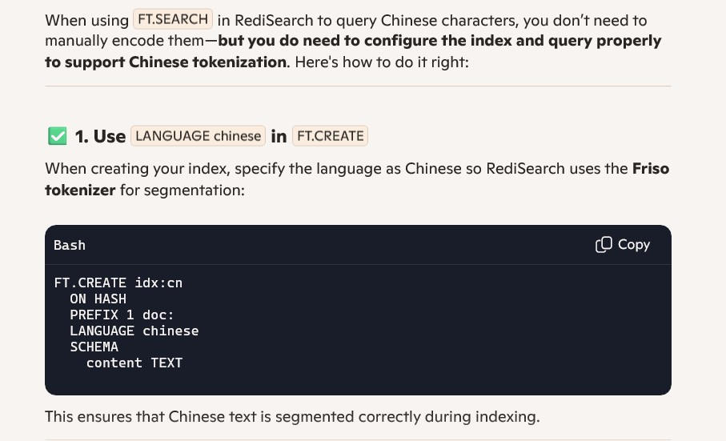
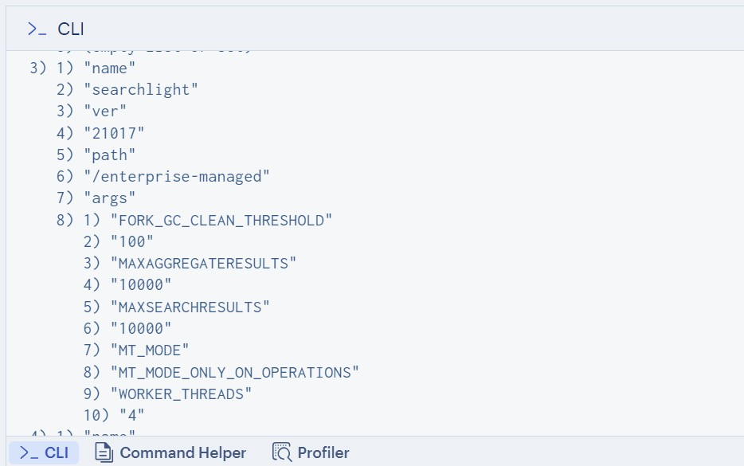
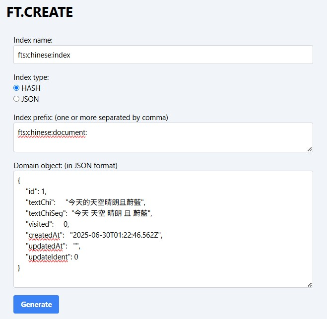
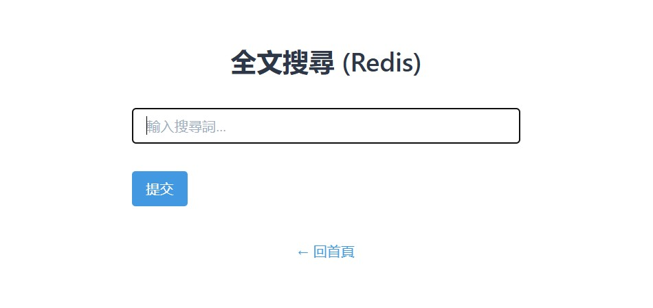

### Fulltext Search in Chinese using Redis
> From vectorization to tokenization; from SQL to NoSQL; 

**DISCLAIMER: Over 90% of this article is written by HIM, i mean AI**




#### Prologue 
To consummate our story of Fulltext Search, we pull out our new friend... Redis is a memoory-first multi-model NoSQL database. The [Redis Query Engine](https://redis.io/docs/latest/develop/ai/search-and-query/) offers an enhanced Redis experience via the following search and query features:
- A rich query language
- Incremental indexing on JSON and hash documents
- Vector search
- Full-text search
- Geospatial queries
- Aggregations


#### I. [FT.CREATE](https://redis.io/docs/latest/commands/ft.create/) (TL;DR)
The `FT.CREATE` command defines a **search index** over Redis data structures (either `HASH` or `JSON`) to enable full-text, structured, and hybrid search capabilities.

##### 1. Basic Syntax
```bash
FT.CREATE index_name 
  [ON HASH|JSON] 
  [PREFIX count prefix ...] 
  [FILTER expression] 
  [LANGUAGE default_lang] 
  [LANGUAGE_FIELD lang_field] 
  [SCORE default_score] 
  [SCORE_FIELD score_field] 
  [PAYLOAD_FIELD payload_field] 
  [MAXTEXTFIELDS] 
  [TEMPORARY seconds] 
  [NOOFFSETS] 
  [NOFIELDS] 
  [NOHL] 
  [STOPWORDS num word ...] 
  SCHEMA field [AS attribute] type [options...]
```

##### 2. Index Scope and Target

| Option | Description |
|--------|-------------|
| `ON HASH` / `ON JSON` | Specifies the data type to index. Default is `HASH`. |
| `PREFIX count prefix ...` | Restricts indexing to keys with specific prefixes. |
| `FILTER expression` | Lua-like expression to filter which documents are indexed. |
| `TEMPORARY seconds` | Creates a temporary index that expires after the given time. |

##### 3. Language and Scoring

| Option | Description |
|--------|-------------|
| `LANGUAGE lang` | Sets the default language for stemming (e.g., `english`, `chinese`). |
| `LANGUAGE_FIELD field` | Dynamically sets language per document using a field. |
| `SCORE float` | Assigns a default relevance score to all documents. |
| `SCORE_FIELD field` | Dynamically assigns scores from a document field. |
| `PAYLOAD_FIELD field` | Stores custom metadata (payload) for each document. |

##### 4. Performance and Memory Flags

| Flag | Effect |
|------|--------|
| `MAXTEXTFIELDS` | Optimizes indexing when many text fields are used. |
| `NOOFFSETS` | Disables term offset tracking (saves memory, disables highlighting/summarization). |
| `NOFIELDS` | Disables field name indexing (saves memory). |
| `NOHL` | Disables highlighting support. |
| `STOPWORDS num word ...` | Custom stopword list; use `0` to disable stopwords entirely. |

##### 5. SCHEMA Definition

The `SCHEMA` section defines which fields to index and how. Each field can be renamed using `AS`.

- Field Types and Options

| Type | Description | Options |
|------|-------------|---------|
| `TEXT` | Full-text searchable field | `WEIGHT`, `PHONETIC`, `NOSTEM`, `SORTABLE`, `UNF`, `WITHSUFFIXTRIE` |
| `TAG` | Exact-match field with comma-separated values | `SEPARATOR`, `CASE-SENSITIVE`, `SORTABLE` |
| `NUMERIC` | Numeric field for range queries | `SORTABLE` |
| `GEO` | Geospatial field (lat/lon) | — |
| `VECTOR` | Vector field for similarity search | `FLAT` or `HNSW` algorithm with parameters |

- Example: Indexing Books
```bash
FT.CREATE booksIdx ON HASH PREFIX 1 book: 
  SCHEMA 
    title TEXT WEIGHT 5.0 
    author TEXT 
    genre TAG 
    published NUMERIC 
    location GEO
```
This creates an index on keys like `book:*`, indexing title and author for full-text, genre for filtering, published year for range queries, and location for geo queries.

##### 6. Advanced Use Cases

- **Multilingual Search**: Use `LANGUAGE_FIELD` to stem documents in their native language.
- **Dynamic Scoring**: Combine `SCORE_FIELD` with user engagement metrics.
- **Hybrid Search**: Combine `TEXT` and `VECTOR` fields for semantic + lexical search.
- **Payloads**: Store metadata like click-through rates or categories for downstream use.


#### II. [FT.SEARCH](https://redis.io/docs/latest/commands/ft.search/) (TL;DR)
The `FT.SEARCH` command performs **full-text, structured, and hybrid queries** on a RediSearch index. It retrieves documents that match a given query string, with support for filtering, sorting, highlighting, summarization, and vector similarity.

##### 1. Basic Syntax
```bash
FT.SEARCH index query 
  [NOCONTENT] 
  [LIMIT offset num] 
  [SORTBY field [ASC|DESC]] 
  [RETURN num field ...] 
  [WITHSCORES] 
  [WITHPAYLOADS] 
  [FILTER field min max] 
  [GEOFILTER field lon lat radius m|km|ft|mi] 
  [INKEYS num key ...] 
  [INFIELDS num field ...] 
  [HIGHLIGHT [FIELDS num field ...] [TAGS open close]] 
  [SUMMARIZE [FIELDS num field ...] [FRAGS num] [LEN num] [SEPARATOR str]] 
  [PARAMS num name value ...] 
  [DIALECT dialect_version]
```

##### 2. Query Language Features

| Feature | Description |
|--------|-------------|
| **Free-text search** | Supports stemming, stopword filtering, and tokenization. |
| **Field targeting** | Use `@field:term` to restrict search to specific fields. |
| **Boolean logic** | Combine terms with `AND`, `OR`, `-` (NOT). |
| **Wildcards** | Use `*` and `?` for prefix/suffix/infix matching. |
| **Fuzzy search** | Use `%term%` for Levenshtein distance-based matching. |
| **Exact match** | Use double quotes `"exact phrase"` or `==value`. |
| **Numeric ranges** | Use `FILTER` for numeric fields. |
| **Geo queries** | Use `GEOFILTER` for lat/lon + radius filtering. |
| **Vector search** | Combine with `VECTOR` clause for hybrid semantic search. |

##### 3. Result Control Options

| Option | Description |
|--------|-------------|
| `LIMIT offset num` | Pagination control. |
| `SORTBY field ASC|DESC` | Sort results by a sortable field. |
| `RETURN num field ...` | Specify which fields to return. |
| `WITHSCORES` | Include relevance scores. |
| `WITHPAYLOADS` | Return payloads stored with documents. |
| `NOCONTENT` | Return only document IDs (no fields). |

##### 4. Highlighting & Summarization

| Feature | Description |
|--------|-------------|
| `HIGHLIGHT` | Wrap matching terms in tags (default: `<b>`, `</b>`). |
| `SUMMARIZE` | Extracts text fragments with matches. Options: `FRAGS`, `LEN`, `SEPARATOR`. |

##### 5. Filtering & Targeting

| Option | Description |
|--------|-------------|
| `FILTER field min max` | Numeric range filter. |
| `GEOFILTER field lon lat radius unit` | Geospatial filtering. |
| `INKEYS num key ...` | Restrict search to specific keys. |
| `INFIELDS num field ...` | Restrict search to specific fields. |

##### 6. Parameters & Dialects

| Option | Description |
|--------|-------------|
| `PARAMS num name value ...` | Pass named parameters for dynamic queries. |
| `DIALECT version` | Use advanced query syntax (e.g., `DIALECT 2` for vector search). |

##### 7. Examples

- Example 1: Basic Full-Text Search
```bash
FT.SEARCH booksIdx "redis search engine"
```
Searches for documents containing all three terms.

- Example 2: Field-Specific + Sorting + Pagination
```bash
FT.SEARCH booksIdx "@genre:{sci-fi} @author:Asimov"
  SORTBY published DESC 
  LIMIT 0 5 
  RETURN 3 title published genre
```
Finds sci-fi books by Asimov, sorted by publish date, returning top 5 with selected fields.

- Example 3: Highlighting and Summarization
```bash
FT.SEARCH booksIdx "quantum computing"
  HIGHLIGHT FIELDS 1 description TAGS <em> </em>
  SUMMARIZE FIELDS 1 description FRAGS 2 LEN 30 SEPARATOR "..."
```
Returns snippets from the `description` field with highlighted terms.

- Example 4: Hybrid Vector + Text Search
```bash
FT.SEARCH myIdx "*"
  PARAMS 2 vec_blob $blob
  VECTOR_RANGE v_field 1 BLOB $blob DIALECT 2
```
Performs a vector similarity search using a binary blob and RediSearch dialect 2.

##### 8. Notes & Best Practices

- **Stemming and stopwords** are language-dependent; configure via `FT.CREATE`.
- **Performance**: Use `NOCONTENT`, `RETURN`, and `LIMIT` to reduce payload.
- **Security**: Only returns keys the user has read access to.
- **Vector search** requires RediSearch 2.4+ and proper `FT.CREATE` schema.


#### III. Building the index 
First, check to see if your Redis installation has search capability with either `INFO modules` or `MODULE list`. 


Redis Query Engine supports Fulltext Search in Chinese out of the box! 
> [Chinese support](https://redis.io/docs/latest/develop/interact/search-and-query/advanced-concepts/chinese/) allows Chinese documents to be added and tokenized using segmentation rather than simple tokenization using whitespace and/or punctuation.

> Indexing a Chinese document is different than indexing a document in most other languages because of how tokens are extracted. While most languages can have their tokens distinguished by separation characters and whitespace, this is not common in Chinese.

> Chinese tokenization is done by scanning the input text and checking every character or sequence of characters against a dictionary of predefined terms, and determining the most likely match based on the surrounding terms and characters.

> Redis makes use of the [Friso](https://github.com/lionsoul2014/friso) Chinese tokenization library for this purpose. This is largely transparent to the user and often no additional configuration is required.

According to [FT.CREATE](https://redis.io/docs/latest/commands/ft.create/) documentation: 

**LANGUAGE_FIELD {lang_attribute}**

> is a document attribute set as the document language.

> A stemmer is used for the supplied language during indexing. If an unsupported language is sent, the command returns an error. The supported languages are Arabic, Basque, Catalan, Danish, Dutch, English, Finnish, French, German, Greek, Hungarian, Indonesian, Irish, Italian, Lithuanian, Nepali, Norwegian, Portuguese, Romanian, Russian, Spanish, Swedish, Tamil, Turkish, and Chinese.

> When adding Chinese language documents, set LANGUAGE chinese for the indexer to properly tokenize the terms. If you use the default language, then search terms are extracted based on punctuation characters and whitespace. The Chinese language tokenizer makes use of a segmentation algorithm (via [Friso](https://github.com/lionsoul2014/friso)), which segments text and checks it against a predefined dictionary. See [Stemming](https://redis.io/docs/latest/develop/interact/search-and-query/advanced-concepts/stemming/) for more information.

According to [FT.SEARCH](https://redis.io/docs/latest/commands/ft.search/) documentation: 

**LANGUAGE_FIELD {lang_attribute}**

use a stemmer for the supplied language during search for query expansion. If querying documents in Chinese, set to chinese to properly tokenize the query terms. Defaults to English. If an unsupported language is sent, the command returns an error. See F[T.CREATE](https://redis.io/docs/latest/commands/ft.create/) for the list of languages. If LANGUAGE was specified as part of index creation, it doesn't need to specified with FT.SEARCH.

Instead of crafting `FT.CREATE` command from scratch, a small utility [FTCREATE Helper](https://albert0i.github.io/src/FTCREATE.html) may give you a hand. To envisage the data model in JSON format, for example: 
```
{
    "id": 1,
    "textChi":     "今天的天空晴朗且蔚藍", 
    "visited":     0, 
    "createdAt":   "2025-06-30T01:22:46.562Z", 
    "updatedAt":   "", 
    "updateIdent": 0
}
```

Paste it in, answer a couple of questions and press `generate`: 


Slightly modify and beautify as needed: 
```
FT.CREATE fts:chinese:index 
    ON HASH PREFIX 1 fts:chinese:document: LANGUAGE chinese 
    SCHEMA 
    id NUMERIC SORTABLE 
    textChi TEXT WEIGHT 1.0 SORTABLE     
    visited NUMERIC SORTABLE 
    createdAt TAG SORTABLE 
    updatedAt TAG SORTABLE 
    updateIdent NUMERIC SORTABLE 
```
**Note**

1. `LANGUAGE chinese` is required, obviously; 
2. Only fields to be searched should be indexed; 
```
FT.CREATE fts:chinese:index 
    ON HASH PREFIX 1 fts:chinese:document: LANGUAGE chinese 
    SCHEMA 
    textChi TEXT WEIGHT 1.0 SORTABLE     
    visited NUMERIC SORTABLE 
```
Our minimum version of index can save more space. 

3. Index can be built on a subset of data:
```
FT.CREATE idx_name ON HASH 
  PREFIX 1 doc: 
  FILTER "@status == 'active'" 
  SCHEMA title TEXT body TEXT
```
```
FT.CREATE idx ON JSON 
  FILTER '@type == "article"' 
  SCHEMA $.title AS title TEXT $.tags AS tags TAG
```
> You can create a **partial index** using the `FILTER` clause in the `FT.CREATE` command. This allows you to index only a subset of documents that match a specific condition, similar to partial indexes in traditional RDBMS systems.
4. Index can be built accoss multiple sets of data; 
```
FT.CREATE people_idx ON HASH 
  PREFIX 2 user: customer: 
  SCHEMA name TEXT email TEXT signup_date NUMERIC
```
> RediSearch fully supports indexing across **multiple key prefixes** using the `PREFIX` option in `FT.CREATE`. This allows you to build a single unified index that spans different logical datasets, like user: and customer: —as long as they share a compatible schema.

5. Use `HASH` instead of `JSON` because it is the most similar data structure to RDBMS table. However, `HASH` has its own downside: 
- All values are stored as String;
- Can not have embedded object. 

If it matters, choose JSON. 


#### IV. Dual interfaces 
As far as querying is concerned, there are two interfaces: 

##### 1. `redis.ft.search(index, query, options)`
This is a **high-level API method** provided by Redis client libraries (like `node-redis` or `ioredis`) to execute the RediSearch `FT.SEARCH` command. It allows you to query a full-text index with structured options, without manually formatting the raw Redis command.

**Function Signature**
```js
redis.ft.search(index, query, options)
```

| Parameter | Type | Description |
|----------|------|-------------|
| `index`  | `string` | Name of the RediSearch index to query. |
| `query`  | `string` | The search query string (RediSearch query syntax). |
| `options` | `object` | Optional parameters to control filtering, sorting, pagination, and output. |

**Query Language (2nd Argument)**

The `query` string supports:
- **Full-text search**: `"redis search engine"`
- **Field targeting**: `"@title:redis"`
- **Boolean logic**: `"redis | search -engine"`
- **Fuzzy search**: `"redis~"`
- **Prefix search**: `"red*"`
- **Tag search**: `"@tags:{database|cache}"`

You can combine these with parentheses and logical operators for complex queries.

**Options Object (3rd Argument)**

Here’s a breakdown of the most common and powerful options you can pass:

- `LIMIT`
```js
LIMIT: { from: 0, size: 10 }
```
Controls pagination. Equivalent to `LIMIT offset count`.


- `SORTBY`
```js
SORTBY: { BY: 'published', DIRECTION: 'DESC' }
```
Sorts results by a sortable field. You can use `ASC` or `DESC`.

- `RETURN`
```js
RETURN: ['title', 'author']
```
Specifies which fields to return. If omitted, all fields are returned.

- `WITHSCORES`
```js
WITHSCORES: true
```
Includes a relevance score for each result.

- `WITHPAYLOADS`
```js
WITHPAYLOADS: true
```
Returns payloads if they were stored during indexing.

-`NOCONTENT`
```js
NOCONTENT: true
```
Returns only document IDs (no fields). Useful for lightweight lookups.

- `PARAMS`
```js
PARAMS: { query_vec: '$BLOB' }
```
Used for parameterized queries, especially in hybrid or vector search.

---

- `DIALECT`
```js
DIALECT: 2
```
Enables advanced RediSearch syntax (e.g., vector search, JSONPath). Required for many modern features.

**Example Usage (Node.js)**

```js
await redis.ft.search('booksIdx', '@genre:{sci-fi}', {
  SORTBY: { BY: 'published', DIRECTION: 'DESC' },
  RETURN: ['title', 'author'],
  LIMIT: { from: 0, size: 5 },
  WITHSCORES: true,
  DIALECT: 2
});
```

This searches for sci-fi books, sorts by publish date, returns title and author, includes scores, and uses dialect 2.

**Behind the Scenes**

Internally, this method translates your structured `options` object into a raw Redis command like:
```bash
FT.SEARCH booksIdx "@genre:{sci-fi}" 
  SORTBY published DESC 
  RETURN 2 title author 
  LIMIT 0 5 
  WITHSCORES 
  DIALECT 2
```

**When to Use This API**

| Use Case | Why It’s Ideal |
|----------|----------------|
| Clean, readable code | Avoids manual string formatting. |
| Type-safe development | Works well with TypeScript and IDE autocompletion. |
| Common queries | Covers 90% of RediSearch use cases. |
| Safer escaping | Prevents injection or syntax errors. |

**Limitations**

- May not support **newest RediSearch features** immediately (e.g., hybrid vector + text search).
- For **maximum flexibility**, use `redis.sendCommand([...])`.

**Pros**

- **Readable and intuitive**: Parameters are passed as named arguments.
- **Safer**: Automatically escapes and formats arguments.
- **Easier to maintain**: Especially for complex queries with many options.
- **Typed support**: Often includes TypeScript definitions or IDE hints.

**Cons**

- **Less flexible**: May not support all RediSearch features or new dialects immediately.
- **Library-dependent**: Only available if your Redis client supports RediSearch natively.

##### 2. `redis.sendCommand([...])` — **Low-Level Raw Command**
This is the **manual, flexible method** where you send the raw Redis command and arguments as an array of strings.

**Pros**

- **Full control**: Supports any RediSearch feature, even experimental ones.
- **Future-proof**: Use new options before they're supported in high-level APIs.
- **Universal**: Works with any Redis module or command.

**Cons**

- **Verbose and error-prone**: You must format everything correctly.
- **No validation**: Typos or wrong argument order can cause silent failures.
- **Harder to read**: Especially with long or dynamic queries.

**Example**

```js
await redis.sendCommand([
  'FT.SEARCH',
  'booksIdx',
  '@genre:{sci-fi}',
  'SORTBY', 'published', 'DESC',
  'RETURN', '2', 'title', 'author',
  'LIMIT', '0', '10'
]);
```

##### 3. **Summary Table**

| Feature              | `redis.ft.search(...)`         | `redis.sendCommand([...])`         |
|----------------------|-------------------------------|------------------------------------|
| Abstraction level    | High                          | Low                                |
| Readability          | ✅ Easy to read                | ❌ Verbose                         |
| Flexibility          | ❌ Limited to supported options | ✅ Full RediSearch support         |
| Error handling       | ✅ Safer with validation       | ❌ Manual formatting required      |
| Use case             | Standard queries               | Advanced/custom/dialect queries    |

**Note**

1. `redis.ft.search(index, query, options)` always returns in `{ total: integer, documents: [ { id:string, value:object }, ...]}` format which is easier to interpret, akin to Prisma [CRUD](https://www.prisma.io/docs/orm/prisma-client/queries/crud) interface; 
2. `redis.sendCommand([...])` *only* accept an array of string where Number must be wrapped by quotation mark. You can practically do everything with `redis.sendCommand([...])` in the same way as [Redis CLI](https://redis.io/docs/latest/develop/tools/cli/), akin to Prisma [Raw queries](https://www.prisma.io/docs/orm/prisma-client/using-raw-sql/raw-queries) interface. 
3. `redis.sendCommand([...])` returns various formats depending on the command to call. More often than not, this involves array of array with interleaved string and/or number in between or even a page of text which makes decoding the result a challenging drudgery. 


#### V. Seeding 
Using the same set of 1,200 Chinese sentences, go ahead to seed Redis with. 

`seedRedis.js`
```
import { redis } from './redis/redis.js'
import { getIndexName, getDocumentKeyName, checkIndex, createIndex } from './redisHelper.js'
import { documents } from '../data/documents.js'

await redis.connect()
/*
    Flush all data     
*/
await redis.flushDb()

/*
   main 
*/
if ( await checkIndex() ) {
    console.log(`Found index ${getIndexName()}, skip creation...`)
} else {
    console.log(`Creating index ${getIndexName()}...`)
    console.log(await createIndex()) 
}

let promises = [];
for (let i = 0; i < documents.length; i++) {
    const now = new Date(); 
    const isoDate = now.toISOString(); 
    
    promises.push(redis.hSet(getDocumentKeyName(i + 1), {
        id: i + 1, 
        textChi: documents[i],        
        visited:   0, 
        createdAt: isoDate, 
        updatedAt: "", 
        updateIdent: 0
    } ) )
}
await Promise.all(promises)
console.log('Seeding finished!')

await redis.close()
```

It also takes care of index creation. Two functions `checkIndex()` and `createIndex()` are worth noting: 

`redisHelper.js`
```
export function getIndexName() {
   return 'fts:chinese:index';
}

export function getDocumentKeyName(id) {
    return `fts:chinese:documents:${id}`
}

export async function checkIndex() {
   const indexList = await redis.ft._list()

   return indexList.includes(getIndexName())
}

export async function createIndex() {
   const redisCommand = `FT.CREATE ${getIndexName()} ON HASH PREFIX 1 ${getDocumentKeyName('')} LANGUAGE chinese SCHEMA id NUMERIC SORTABLE textChi TEXT WEIGHT 1.0 SORTABLE visited NUMERIC SORTABLE createdAt TAG SORTABLE updatedAt TAG SORTABLE updateIdent NUMERIC SORTABLE`

   return await redis.sendCommand(redisCommand.split(' '))
}
```

Previously, we played trick to implement `UPSERT` while seeding  MariaDB:
```
// Add new document
    return await prisma.$executeRaw`
                    INSERT INTO documents (textChi, embedding) 
                    VALUES( ${document}, VEC_FromText(${JSON.stringify(vector)}) ) 
                    ON DUPLICATE KEY 
                    UPDATE updateIdent = updateIdent + 1;
              `;              
```

There is no difference between insert and update in Redis and let alone `UPSERT`. Later call to `hSet` effectively overrides the previous one. If it matters to you, use this: 
```
    const exists = await redis.exists(getDocumentKeyName(i + 1));
    if (!exists) {
        await redis.hSet(getDocumentKeyName(i + 1), {
                id: i + 1, 
                textChi: documents[i],        
                visited:   0, 
                createdAt: isoDate, 
                updatedAt: "", 
                updateIdent: 0
            } )
    } else {
      await redis.hIncrBy(getDocumentKeyName(i + 1), 'updateIdent', 1)
    }
```

To mimic the behavior. 


#### VI. Querying 
`redisHelper.js`
```
export async function findDocuments(query, offset=0, limit = 10) {
    const indexName = getIndexName()
    const redisCommand = [ 'FT.SEARCH', indexName, query.trim(), 'WITHSCORES', 'RETURN', '2', 'textChi', 'id', 'LIMIT', offset.toString(), limit.toString() ]

    // Find documents 
    const searchResults = await redis.sendCommand(redisCommand);
    // “Even the straightest road has its twist.”
    const docs = twist(searchResults)
 
    // Update `visited` field
    const promises = [];    // Collect promises 
    docs.forEach(doc => { 
         const docKey = getDocumentKeyName(doc.id)
         const now = new Date(); 
         const isoDate = now.toISOString(); 

         // Use transaction
         promises.push( 
                        redis.multi()
                        .hIncrBy(docKey, 'visited', 1)
                        .hSet(docKey, 'updatedAt', isoDate)
                        .hIncrBy(docKey, 'updateIdent', 1)
                        .exec()
            )
        })
    await Promise.all(promises); // Resolve all at once
    
    return docs
 }
 
 export async function countDocuments(query='*') { 
   const indexName = getIndexName()
    // Count documents 
    // { total: integer, documents: [ { id:string, value:object }, ...]}
    const { total } = await redis.ft.search(indexName, query.trim(), {
       NOCONTENT: true,
       LIMIT: {
          from: 0, // Offset
          size: 0  // Number of results to return
       }
   }); 
 
   return total
 }
```
`findDocuments` is an exemplar of `redis.sendCommand([...])`, since `WITHSCORES` simply won't work on `redis.ft.search(key, query, options)`. 

Previously, we have used SQL to update a visited document: 
```
      UPDATE documents 
      SET visited = visited + 1, 
          updatedAt = Now(), 
          updateIdent = updateIdent + 1
      WHERE id=${doc.id}
```

There is no corresponding command in Redis. Therefore, a transaction is used to wrap them together so that Redis will treat them as a single action and maintain the atomicity. 
```
      redis.multi()
      .hIncrBy(docKey, 'visited', 1)
      .hSet(docKey, 'updatedAt', isoDate)
      .hIncrBy(docKey, 'updateIdent', 1)
      .exec()
```

# “Even the straightest road has its twist.”


#### VII. Wrap-Up
Start the server: 
```
npm run dev 
```

And navigate to [http://localhost:3000/ftsredis](http://localhost:3000/ftsredis): 



And [http://localhost:3000/statsredis](http://localhost:3000/statsredis)

Enjoy! 

[Back to part 1](README.2.md)

**PS:**

If you follow along to this point that means you are a great fan of me --- an old and jaded journeyman. To conclude our journal with a list of articles: 
1. [Vector Semantic Search in Chinese using MariaDB](README.md)
2. [Fulltext Search in Chinese using MariaDB](README.2.md)
3. [Fulltext Search in Chinese using Oracle 19c](README.3.md)
4. [Fulltext Search in Chinese using Redis](README.4.md)

As a last [bonus](README.cont.md), any RDBMS capable of storing array of float and supports user defined function can be used to implement Vector Semantic Search so to speak, but performance varies, of course. 


#### VIII. Bibliograhy 
1. [Redis Query Engine](https://redis.io/docs/latest/develop/ai/search-and-query/)
2. [FT.CREATE](https://redis.io/docs/latest/commands/ft.create/)
3. [FT.SEARCH](https://redis.io/docs/latest/commands/ft.search/)
4. [Node-Redis](https://www.npmjs.com/package/redis)
5. [The Castle by Franz Kafka](https://files.libcom.org/files/Franz%20Kafka-The%20Castle%20(Oxford%20World's%20Classics)%20(2009).pdf)


#### Epilogue 
"Study things carefully and you will see their difference. More importantly is to know WHY they are different. For everything has a reason.. "

"It's a kind of superstitious, superstitious in science and betrayal of common sense..."

[Modern Redis Crash Course: Backend with Express, TypeScript and Zod]()


### EOF (2025/07/04)
