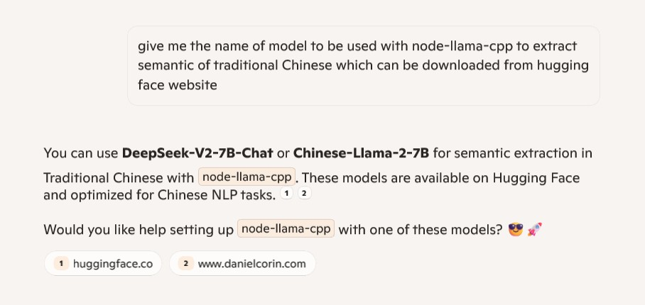
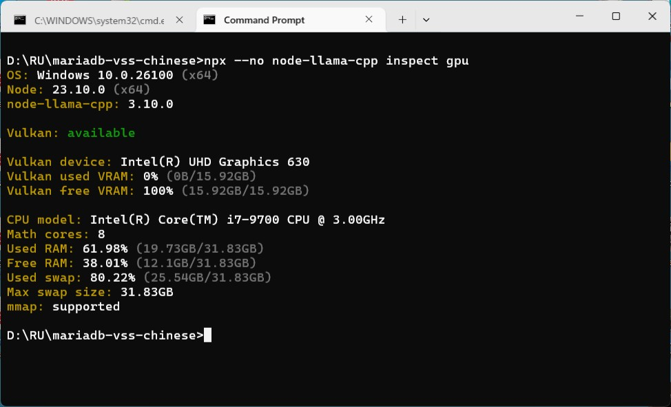
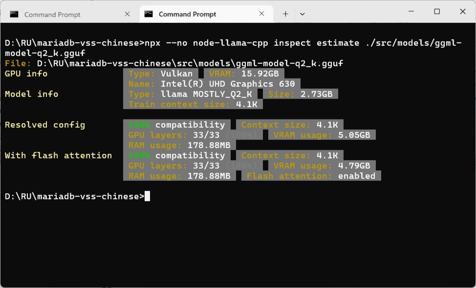
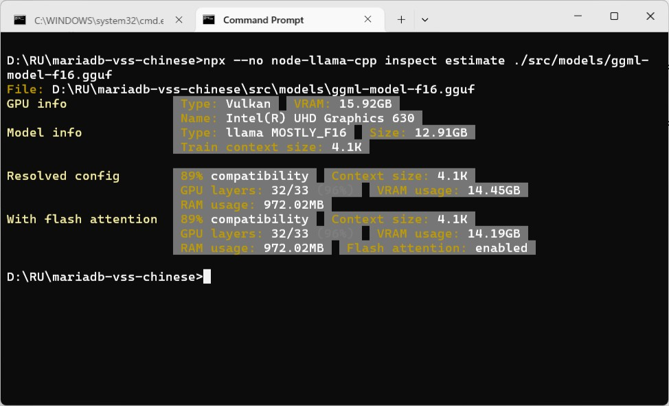
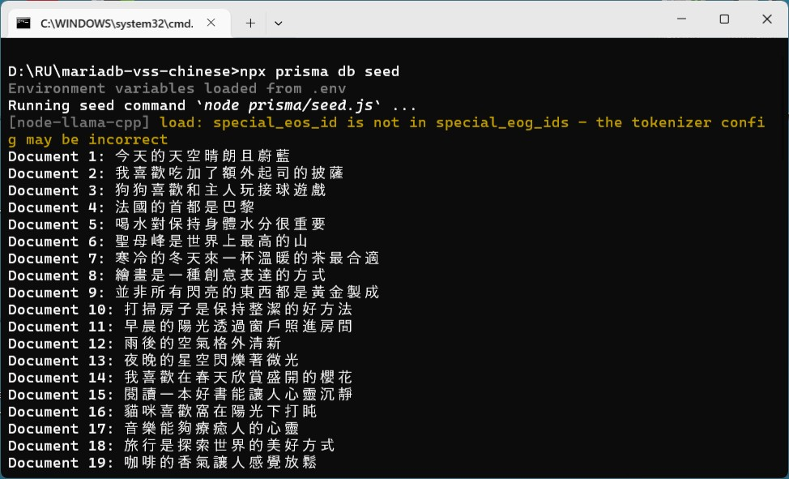
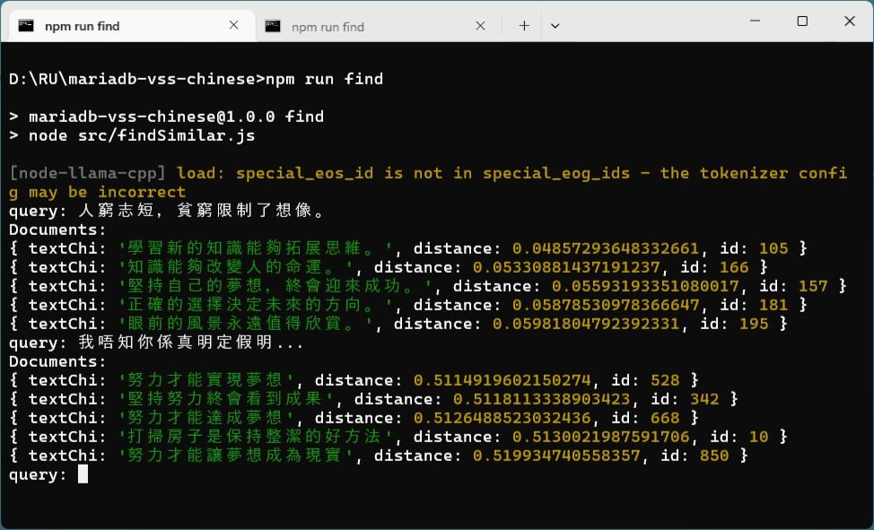
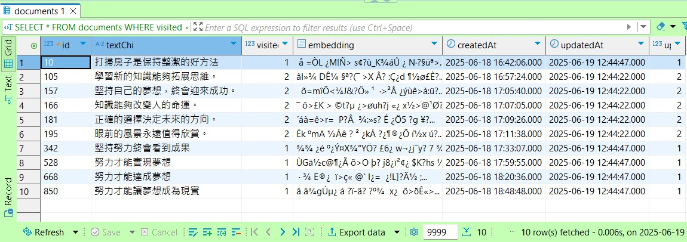

### Vector Semantic Search in Chinese using MariaDB
> "the ridiculous confusion which, in some circumstances, can determine the course of a man’s life."<br />The Castle by Franz Kafka


#### Prologue 
- [Vector Semantic Search using MariaDB (Part 1/3)](https://github.com/Albert0i/mariadb-vss/blob/main/README.md)
- [Vector Semantic Search using MariaDB (Part 2/3)](https://github.com/Albert0i/mariadb-vss/blob/main/README.2.md)
- [Vector Semantic Search using MariaDB (Part 3/3)](https://github.com/Albert0i/mariadb-vss/blob/main/README.3.md)


#### I. [Choosing a Model](https://github.com/withcatai/node-llama-cpp/blob/master/docs/guide/choosing-a-model.md)
Previously we used VSS on English data. *Every tool would render useless if it can not work on one's native language*. We need to do the same thing on Chinese data, typically [traditional Chinese](https://en.wikipedia.org/wiki/Traditional_Chinese_characters). To be able to extract semantic, we need a different model as it is suggested by AI. 



I head into [Hugging Face](https://huggingface.co/) website and search for [Chinese-Llama-2-7B](https://huggingface.co/hfl/chinese-llama-2-7b-gguf/tree/main) model and inspect my computer with: 

```
npx --no node-llama-cpp inspect gpu
```



> If the machine you plan to run this model on doesn't have a GPU, you'd probably want to use a small model that can run on a CPU with decent performance.

> If you have a GPU, the amount of VRAM you have will determine the size of the model you can run. Ideally, you'd want to fit the entire model in the VRAM to use only the GPU and achieve maximum performance. If the model requires more memory than the available VRAM, parts of it will be offloaded to the RAM and be evaluated using the CPU, significantly reducing the efficiency and speed of inference. 

To get a more accurate estimation of how well a model will run: 
```
npx --no node-llama-cpp inspect estimate ./src/models/ggml-model-q2_k.gguf
```






**Suggestion from AI**
> Your GPU **can handle models up to around 15GB VRAM usage**, but for **efficient performance**, models should **stay below 80% of total VRAM** (~12GB). If you want **bigger models**, you may need a GPU with more memory or offload layers to **CPU RAM (slower but possible).**

1. ggml-model-q2_k.gguf (2.73G)
2. ggml-model-q4_k.gguf (3.92G)
3. ggml-model-q8_0.gguf (6.85G)
4. ggml-model-f16.gguf (12.9G)

To strike a balance between speed and accuracy, I opt `ggml-model-q4_k.gguf` (3.92G) instead of `ggml-model-q8_0.gguf` (6.85G). A short comparison is in [here](compare.md). Both of them generate vector of 4096 dimensions. 

I have the AI generated 1,200 sentences in traditional Chinese and put it in an array for sake of simplicity. A more realistic scenario would load the data from [Oracle](https://en.wikipedia.org/wiki/Oracle) or by parsing a [CSV](https://en.wikipedia.org/wiki/Comma-separated_values) file, for example. 

It is *crucial* to choose the right model in the first place, change of model involves re-creating all vector embeddings may take hours or even days. 


#### II. [Using Embedding](https://github.com/withcatai/node-llama-cpp/blob/master/docs/guide/embedding.md)
First of all, create a table in target database: 

```
USE vss;

CREATE TABLE documents (
  id          INT AUTO_INCREMENT PRIMARY KEY,

  textChi     VARCHAR(512) NOT NULL, 
  visited     INT DEFAULT 0, 
  embedding   VECTOR(4096) NOT NULL,  
  
  createdAt   TIMESTAMP DEFAULT CURRENT_TIMESTAMP, 
  updatedAt   TIMESTAMP, 
  updateIdent INT DEFAULT 0, 
    
  UNIQUE (textChi),
  VECTOR INDEX (embedding) M=16 DISTANCE=cosine
);
```

Note: 
1. Number of dimensions is determined by model output; 
2. Only one vector index per table and can not be NULL; 
3. `M` — Larger values mean slower SELECTs and INSERTs, larger index size and higher memory consumption but more accurate results. The valid range is from `3` to `200`.
4. `DISTANCE` — Distance function to build the vector index for. Searches using a different distance function will not be able to use a vector index. Valid values are `cosine` and `euclidean` (the default). 

Next, install Prisma, pull in model and generate client code. 
```
model documents {
  id          Int                         @id @default(autoincrement())
  textChi     String                      @unique(map: "textChi") @db.VarChar(512)
  visited     Int?                        @default(0)
  embedding   Unsupported("vector(4096)")
  createdAt   DateTime?                   @default(now()) @db.Timestamp(0)
  updatedAt   DateTime?                   @db.Timestamp(0)
  updateIdent Int?                        @default(0)

  @@index([embedding], map: "embedding")
}
```

The template to generate vector embedding is from [here](https://github.com/withcatai/node-llama-cpp/blob/master/docs/guide/embedding.md): 
```
import {fileURLToPath} from "url";
import path from "path";
import {getLlama, LlamaEmbedding} from "node-llama-cpp";

const __dirname = path.dirname(
    fileURLToPath(import.meta.url)
);

const llama = await getLlama();
const model = await llama.loadModel({
    modelPath: path.join(__dirname, "bge-small-en-v1.5-q8_0.gguf")
});
const context = await model.createEmbeddingContext();

async function embedDocuments(documents: readonly string[]) {
    const embeddings = new Map<string, LlamaEmbedding>();

    await Promise.all(
        documents.map(async (document) => {
            const embedding = await context.getEmbeddingFor(document);
            embeddings.set(document, embedding);

            console.debug(
                `${embeddings.size}/${documents.length} documents embedded`
            );
        })
    );

    return embeddings;
}

function findSimilarDocuments(
    embedding: LlamaEmbedding,
    documentEmbeddings: Map<string, LlamaEmbedding>
) {
    const similarities = new Map<string, number>();
    for (const [otherDocument, otherDocumentEmbedding] of documentEmbeddings)
        similarities.set(
            otherDocument,
            embedding.calculateCosineSimilarity(otherDocumentEmbedding)
        );

    return Array.from(similarities.keys())
        .sort((a, b) => similarities.get(b)! - similarities.get(a)!);
}

const documentEmbeddings = await embedDocuments([
    "The sky is clear and blue today",
    "I love eating pizza with extra cheese",
    "Dogs love to play fetch with their owners",
    "The capital of France is Paris",
    "Drinking water is important for staying hydrated",
    "Mount Everest is the tallest mountain in the world",
    "A warm cup of tea is perfect for a cold winter day",
    "Painting is a form of creative expression",
    "Not all the things that shine are made of gold",
    "Cleaning the house is a good way to keep it tidy"
]);


const query = "What is the tallest mountain on Earth?";
const queryEmbedding = await context.getEmbeddingFor(query);

const similarDocuments = findSimilarDocuments(
    queryEmbedding,
    documentEmbeddings
);
const topSimilarDocument = similarDocuments[0];

console.log("query:", query);
console.log("Document:", topSimilarDocument);
```

Which is a good start! 


#### III. [Seeding](https://www.prisma.io/docs/orm/prisma-migrate/workflows/seeding)
A cheap trick is used to implement `UPSERT` in MariaDB, which is described in [INSERT ON DUPLICATE KEY UPDATE](https://mariadb.com/docs/server/reference/sql-statements/data-manipulation/inserting-loading-data/insert-on-duplicate-key-update). An `UPSERT` prevents from inserting duplicated entry and let's keep track of the duplication. 
```
export async function addDocument(document) {
    const { vector } = await context.getEmbeddingFor(removeWords(document));

    // Add new document
    return await prisma.$executeRaw`
                    INSERT INTO documents (textChi, embedding) 
                    VALUES( ${document}, VEC_FromText(${JSON.stringify(vector)}) ) 
                    ON DUPLICATE KEY 
                    UPDATE updateIdent = updateIdent + 1;
              `;
}
```

Run command to seed database: 
```
npx prisma db seed
```



Depending on the machine, it may take hours or even days... AFter that verify if there is duplicated entry with: 
```
SELECT * FROM documents WHERE updateIdent <> 0; 
```


#### IV. Finding the documetns 
Most of the code remains the same, we only add update to `visited` field so that we can check to see search results. 
```
export async function findSimilarDocuments(document, limit = 3) {
    const { vector } = await context.getEmbeddingFor(removeWords(document));

    // Find similar documents 
    const docs = await prisma.$queryRaw`
                          SELECT textChi, 
                                 VEC_DISTANCE_COSINE(
                                    embedding,
                                    VEC_FromText(${JSON.stringify(vector)})
                                    ) AS distance, 
                                 id
                          FROM documents 
                          ORDER BY 2 ASC
                          LIMIT ${limit} OFFSET 0;
                        `; 

    // Update `visited` field                                    
    const promises = [];    // Collect promises 
    docs.forEach(doc => { 
            promises.push(prisma.$executeRaw`
                            UPDATE documents 
                            SET visited = visited + 1, 
                                updatedAt = Now(), 
                                updateIdent = updateIdent + 1
                            WHERE id=${doc.id}
                          `
              )
        })
    await Promise.all(promises); // Resolve all at once

    return docs 
}
```

Run command to find the documents: 
```
npm run find
```


Verify search results with: 
```
SELECT * FROM documents WHERE visited <> 0; 
```




#### V. Bibliography 
1. [Choosing a Model](https://github.com/withcatai/node-llama-cpp/blob/master/docs/guide/choosing-a-model.md)
2. [Using Embedding](https://github.com/withcatai/node-llama-cpp/blob/master/docs/guide/embedding.md)
3. [Raw queries](https://www.prisma.io/docs/orm/prisma-client/using-raw-sql/raw-queries)
4. [Transactions and batch queries](https://www.prisma.io/docs/orm/prisma-client/queries/transactions)
5. [The Castle by Franz Kafka](https://files.libcom.org/files/Franz%20Kafka-The%20Castle%20(Oxford%20World's%20Classics)%20(2009).pdf)


#### Epilogue
> "I am certainly ignorant, but facts are facts, which is very sad for me but also advantageous, since an ignorant man will dare to do more, so I will happily go about in my ignorance with what I am sure are its unfortunate consequences for a little longer, as long as my strength allows. "<br />The Castle by Franz Kafka


### EOF (2025/06/30)